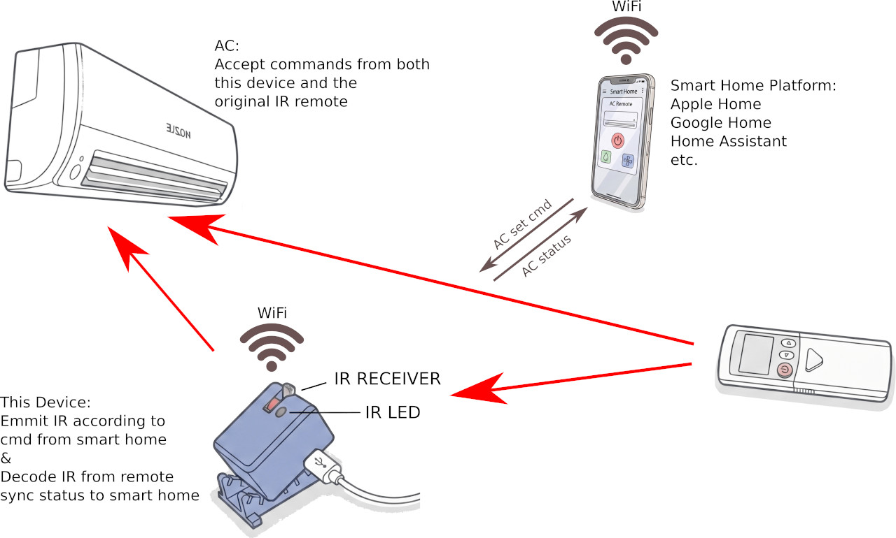
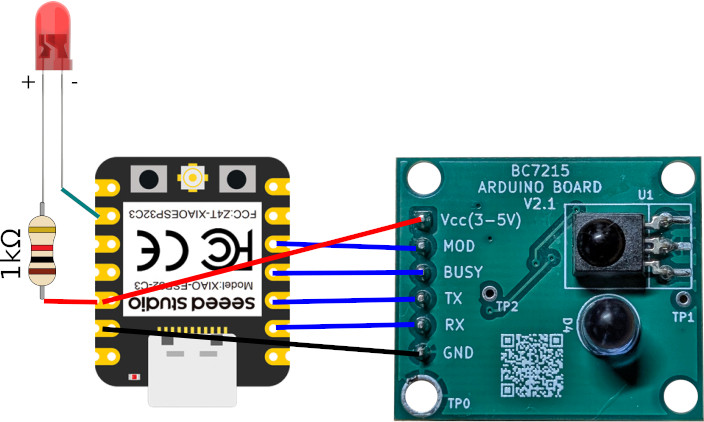
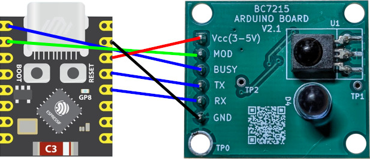
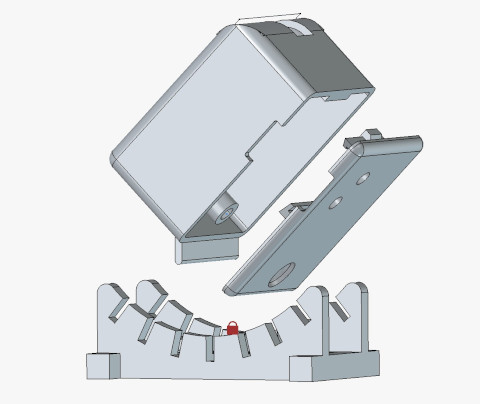

# Matter Protocol Air Conditioner Controller for Any Brand (ESP32 + BC7215 Project)

## Key Features

- Connect virtually any air conditioner—old or new, directly to Apple Home, Google Home, or Home Assistant
- No app installation required
- No account registration required
- No touching the air conditioner's internal circuit required



Matter is a new IoT protocol that is now built into iPhones and Android phones. This means that Matter-compatible devices can be operated directly in environments such as Apple Home without installing a dedicated app.

This device is an offline air conditioner controller. The air-conditioner control function itself does not require a network connection, so it does not depend on any third-party service and does not require account registration.

If you already use Home Assistant, the sister project—the ESPHome version of this project ([https://github.com/timj-code/bc7215_ac_esphome](https://github.com/timj-code/bc7215_ac_esphome))—may be more suitable for you. Matter support for air conditioners is still at an early stage and provides relatively limited functionality, so it is not as comprehensive as Home Assistant.

Based on my experience during development, neither Apple Home nor Google Home is especially smooth enough when controlling devices such as air conditioners that require real-time feedback. There can sometimes be noticeable delays before control results appear on the phone, and establishing a connection can also take a relatively long time. **Overall, however, it is still a very cool way to add smart control to an air conditioner that has not yet been integrated into your smart home—or to give one to a friend who has an iPhone—because it is not restricted to particular air conditioner brands or models, requires no additional app, and requires no extra controller device for iPhone users.**

## Limitations

Matter devices can be used without a dedicated app. This is an advantage, but it also has a downside: the user experience is largely outside the device manufacturer's control. For example, the interface and overall experience may differ significantly between Apple and Android platforms, especially for a complex device such as an air conditioner.

Matter is also still evolving, and its support for air conditioners remains limited. Air conditioner functions are mainly mapped to HVAC system modes. Many functions found on split-system air conditioners have no corresponding mapping in the protocol, or may be defined by the protocol but not yet supported by smartphone platforms.

The limitations I have found so far are listed below.

#### Protocol Limitations

| Item                   | Conventional Split-System Air Conditioner                                                                     | Matter Protocol                                                                                                                                                                                                 |
| ---------------------- | ------------------------------------------------------------------------------------------------------------- | --------------------------------------------------------------------------------------------------------------------------------------------------------------------------------------------------------------- |
| Temperature control    | A single target temperature                                                                                   | Separate cooling and heating target temperatures. In Auto mode in particular, a temperature range is set instead of a single target temperature.                                                                |
| Temperature resolution | Usually 1°C. The air conditioner control library used by this device also supports integer temperatures only. | The device cannot specify the temperature adjustment step through the protocol. Apple and Google currently both use 0.5°C as the minimum adjustment step.                                                       |
| Fan control            | Usually four levels: Auto, High, Medium, and Low                                                              | The fan section has its own power switch. The protocol supports both discrete fan levels and percentage-based control, but smartphone vendors currently appear to support only percentage-based fan adjustment. |

Project implementation notes:

- **Modes:** Cooling and Heating are the officially declared Thermostat features and are the modes Apple Home / Google Home typically expose. Off / Cool / Heat are the primary SystemMode values. Auto, Dry, and Fan-only are still accepted when a controller sends them (for example Home Assistant) and are mapped to the BC7215 library; they are not advertised as Thermostat features.
- **Fan mapping:** Fan settings from 1% to 33% map to Low, 34% to 66% to Medium, and values above 66% to High. Auto has no fixed percentage; FanMode remains Auto and the percentage display uses 100%.
- **Temperature step:** When the temperature is set to a value ending in 0.5°C (or any fractional degree), it is rounded to the nearest whole degree because the IR library only supports integer Celsius. Cooling setpoint, heating setpoint, and LocalTemperature are kept in sync to that same whole-degree value.
- **LocalTemperature:** This device has no ambient temperature sensor. The LocalTemperature attribute tracks the commanded target temperature so controllers have a non-null value to display. It is **not** a measured room temperature.
- **Dynamic endpoints:** The firmware creates a Room Air Conditioner endpoint and a separate Fan endpoint. `CONFIG_ESP_MATTER_MAX_DYNAMIC_ENDPOINT_COUNT` must be at least 3 (Root Node is separate). The project `sdkconfig.defaults` already sets this to 3.

#### Limitations Introduced by Application Platforms

I have currently tested only the four platforms below. If you can help test other Matter-compatible IoT platforms, such as Tuya, Xiaomi, or Aqara, and provide feedback, I would be very grateful. Please post your test results in an issue.

| Apple Home                                                                                                                         | Google Home                                                                             | Amazon Alexa                                                                                                                                               | Home Assistant As Matter Controller                                                                         |
| ---------------------------------------------------------------------------------------------------------------------------------- | --------------------------------------------------------------------------------------- | ---------------------------------------------------------------------------------------------------------------------------------------------------------- | ----------------------------------------------------------------------------------------------------------- |
| The iPhone itself can act as a Matter controller, so no additional device is required.                                             | A Google Nest device is required in the home as the controller.                         | An Amazon Echo device is required in the home as the controller.                                                                                           | The Matter add-on must be installed.                                                                        |
| Supports temperature and fan-speed settings, with fan speed shown only as a percentage.                                            | Supports temperature and fan-speed settings, with fan speed shown only as a percentage. | Exposes the air conditioner and fan as two separate devices. The air conditioner supports only on/off control and does not support temperature adjustment. | Supports temperature and fan-speed settings, with fan speed correctly shown as Auto, High, Medium, and Low. |
| Updates to the device's current state are sometimes delayed.                                                                       | Device-state updates are noticeably delayed and may sometimes take one or two minutes.  |                                                                                                                                                            | No noticeable delay.                                                                                        |
| When only the phone is used as the controller, the device can be used only while the phone is connected to the home Wi-Fi network. |                                                                                         |                                                                                                                                                            | Adding the device requires the Home Assistant app to be installed on the phone.                             |

* Delayed device-state updates do not affect commands sent from the phone to the air conditioner. Such commands usually take effect immediately. However, the phone also displays device information such as the current temperature and on/off state. If you look only at the phone without comparing it with the air conditioner's actual operation, the delay can sometimes be very confusing, especially in Google Home. ***(Maybe because I was using a 1st Gen Google Home for testing, it appeared on market earlier than Matter, so could be outdated.)***  For example, you may turn the air conditioner on and it will actually start, while the phone continues to display “OFF” for a long time. Similarly, after changing the temperature with the infrared remote control, it may take a long time before the phone reflects the change.

## Hardware Connections

Online installation is currently provided only for ESP32-C3 modules. However, the project itself can be used with the entire ESP32 family by modifying the I/O definitions and recompiling. Hardware used with the online installer must follow the specified wiring. The firmware supports both ESP32-C3 XIAO and ESP32-C3 Super Mini (PRO) modules. Super Mini modules often experience Wi-Fi connection problems. The XIAO module provides better Wi-Fi performance when used with an external antenna, but because this project requires an LED as a status indicator and the XIAO module does not include one, an external LED must be connected.

**ESP32-C3 XIAO wiring:**



**ESP32-C3 Super Mini (PRO) wiring:**



#### 3D-Printed Enclosure

A STEP file for a 3D-printable enclosure is provided. If you have a 3D printer, you can print the enclosure to make the device look more like a finished product. [See the enclosure documentation here](docs/casing.md).



## Firmware Installation

1. ### Web Install (Recommended)

Online firmware installation is available for ESP32-C3 modules. Users do not need to install any software. After connecting the device to a computer through USB, the firmware can be installed directly from a web browser. Visit the online installation page at: [https://timj-code.github.io/bc7215_ac_matter/](https://timj-code.github.io/bc7215_ac_matter/), and follow the instructions on the page.

2. ### Clone and Compile (Custom Setup)
   
   This method allows you to use any ESP32 variant and customize the GPIO pins to your preference. You will just need to modify the hardware configurations in the `main/app_driver.cpp`.
   
   At the top section of the file:
   
   ```yaml
   static constexpr uart_port_t BC7215_UART_NUM = UART_NUM_1;
   static constexpr gpio_num_t BC7215_RX_PIN = GPIO_NUM_3;
   static constexpr gpio_num_t BC7215_TX_PIN = GPIO_NUM_4;
   static constexpr gpio_num_t BC7215_BUSY_PIN = GPIO_NUM_5;
   static constexpr gpio_num_t BC7215_MOD_PIN = GPIO_NUM_6;
   
   static constexpr gpio_num_t SUPER_MINI_LED_GPIO = GPIO_NUM_8;
   
   ```
   
   ****Important Note:** Do not select a UART port that conflicts with the download/programming port. Also, avoid using GPIO pins that are already assigned to other hardware components (such as LCDs, or buttons).
   
   #### Step 1: Clone the project
   
   Because this project relies on git submodules (the AC control library and examples from [GitHub - bitcode-tech/bc7215_ac_lib · GitHub](https://github.com/bitcode-tech/bc7215_ac_lib)), **do not download it as a ZIP file**. You must use the `git clone --recursive` command to fetch all required dependencies:
   
   `git clone --recursive https://github.com/timj-code/bc7215_ac_matter.git`
   
   #### Step 2: Change chip target
   
   `idf.py set-target esp32`
   
   In Espressive Matter SDK environment, set the target according to your application
   
   #### Step 3: Change Maximum Endpoint Number
   
   When you just changed the target chipset, the Max Endpoint is set to the default value 2; change it to **3** so both the Room Air Conditioner and Fan endpoints can be created (`sdkconfig.defaults` already uses 3 for the online/default build). 
   
   `idf.py menuconfig`
   
   In the menu, search for `MAX_DYNAMIC_ENDPOINT`, and change it to 3.
   
   #### Step 4: Compile & Install
   
   Run the following command in the project root directory:
   
   `idf.py clean`
   
   `idf.py build`
   
   `idf.py -p your/location/of/esp32/serial/port erase-flash flash monitor`

## Setup and Usage

#### Setup

This device requires two setup steps:

- Pair the device with the air conditioner
- Connect the device to a phone or smart-home platform

The two steps can be completed in either order, but pairing the air conditioner first is recommended so that the device can be used immediately after it is connected to the phone.

There are two openings on the rear cover of the device: one for the button and one for the LED.

1. **Pairing with the air conditioner**  After the device is powered on for the first time, the LED should remain steadily lit, indicating that the device has not yet been configured. First, set the air conditioner's infrared remote control to 25°C in Cooling mode. Press the button on the device once. The LED will begin flashing rapidly, indicating that pairing mode is active. Point the air conditioner remote control at the device and press the **Fan Speed** button. Under normal conditions, pairing will then be completed. The LED will change to two short flashes per second, indicating that connection to the phone has not yet been configured.

2. **Connecting to a phone**  Since ESP32 only supports 2.4GHz, it's better to connect your phone to 2.4G Wifi too to prevent potential problems. Open the Apple Home or Google Home app. In Apple Home, select **Add Accessory**. In Google Home, select the option to add a device. A QR-code scanning screen will appear. Scan the Matter commissioning QR code. *(When I'm going to give it to my friends, I will print this QR code and attach it to the enclosure so that the connection setup will be easy. I will also attach another QR code linking to this page as a user manual.)* Follow the on-screen instructions to complete the setup. During the connection process, including reconnection after the device has been powered off, the LED will flash slowly to indicate that a connection is being in negotiation. 
   
   Matter commissioning QR code:
   
   
   
   QR code linking to the user manual (this document):
   
   

Connecting a Matter device is usually relatively slow and often takes tens of seconds. Even after the device has completed the connection process, the phone may take a while to show the device as online. This appears to be caused by the design of the smart-home platform, and there seems to be little that a device developer can do about it.

During phone setup, you will see a warning stating that this is an **uncertified device**. This is because commercial manufacturers must complete certification before receiving a unique device certification code. As this is a DIY device, it cannot obtain such certification, so the warning is displayed. It does not affect functionality.

After the connection is successful, the LED will change to one short flash every three seconds, indicating that the device is ready.

After the device has been successfully added to the phone, interfaces for the thermostat and fan controller should appear. Because of the limitations described above, Cooling and Heating are the modes typically shown on Apple Home and Google Home. Auto, Dry, and Fan-only may appear on some controllers (such as Home Assistant) and are mapped when received. If the temperature is set to a value ending in 0.5°C, it will be rounded to the nearest whole degree because the device does not support fractional-degree IR commands. Similarly, if fan speed is displayed as a continuously adjustable percentage, it will be mapped to the nearest of the three supported levels: High, Medium, or Low. The temperature shown as the device's "current" / local temperature is the commanded target temperature, not a measured room temperature.

In addition to controlling the air conditioner from a phone, the device can synchronize commands sent from the infrared remote control back to the phone. This allows the user to see remote-control operations reflected on the phone. The device should therefore be placed near the air conditioner so that it can also receive the infrared signal whenever the user operates the air conditioner with the remote control. Otherwise, those operations cannot be synchronized.

#### Adding Another Controller

A Matter device can be added to multiple controllers. For example, it can be controlled by both Apple Home and Google Home. It cannot be added directly to another controller. Addition must first be authorised from a phone that is already connected. In Apple Home, this option is shown as **Turn On Pairing Mode**. In Google Home, it is called **Link apps and services**. Selecting it provides a numeric setup code that can be used to add the device on a second platform. In my experience, scanning a QR code usually does not work when adding another controller; the setup-code option must be selected manually.

#### Double-Click to Test Special Protocols

According to the documentation for the AC driver library, a few rare protocols cannot be automatically matched through the standard pairing process. If you have confirmed that your pairing procedure is correct but pairing still fails—or if the status shows paired but the AC does not respond correctly—you can try double-clicking the button to cycle through and test the built-in special AC protocols one by one. You can enter the special protocol test mode by double-clicking the button, regardless of whether the device is currently paired or unpaired.

Once in test mode, each double-click will switch to the next built-in special protocol and simultaneously emit a test signal. Make sure to point the IR LED toward your air conditioner. If your AC responds to a protocol (typically with a beep), that protocol is likely the right one for your unit. You can then verify it by adjusting the temperature on your phone. Controlling by phone will let the device exit this test mode.

During testing, the LED will remain off and only flash when switching protocols; the number of flashes indicates the protocol index number. Once all built-in protocols (currently fewer than 10) have been cycled through, the LED status will return to the "AC Not Paired" state.

#### Resetting the Device

The device can be paired with a different air conditioner at any time without reconfiguring the phone connection. Air conditioner pairing is simple and almost immediate.

To start completely from the beginning, press and hold the device button for five seconds. Release it when the LED begins flashing rapidly. This deletes all network configuration and air conditioner pairing information.

## LED Status Indicators

| LED Behaviour                       | Meaning                                                                             |
| ----------------------------------- | ----------------------------------------------------------------------------------- |
| Steadily on                         | Factory state; the device has not yet been configured.                              |
| Steadily off                        | Not powered or button double clicked (see above)                                    |
| Rapid flashing                      | Waiting to receive an infrared signal for air conditioner pairing.                  |
| Slow flashing                       | Establishing a network connection.                                                  |
| One short flash per second          | The network is configured, but the air conditioner has not yet been paired.         |
| Two short flashes per second        | The air conditioner is paired and the device is waiting to be connected to a phone. |
| One short flash every three seconds | Pairing and connection are complete; the device is in standby mode.                 |
