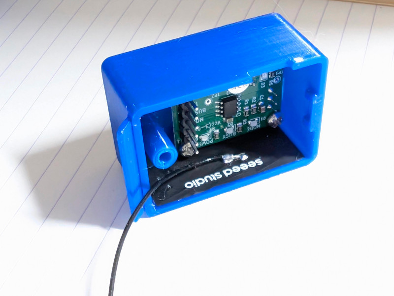
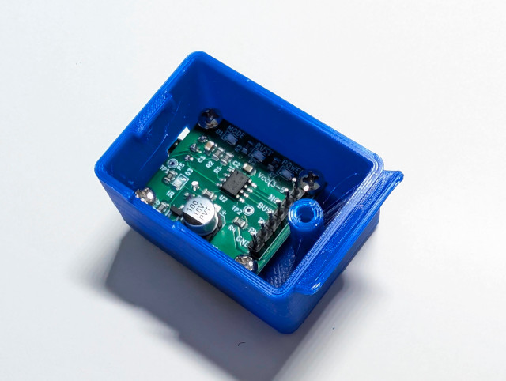
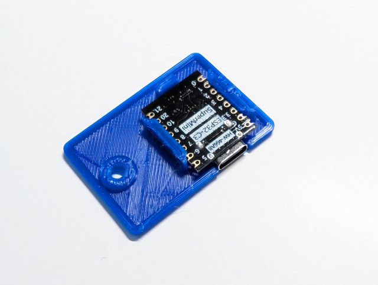

# Case Assembly Instructions

To make this project closer to a real product, I spent about a week learning 3D modeling software and finally designed this enclosure. The design philosophy mainly revolves around the following points:

1. Keep each module in its existing form as much as possible, making minimal modifications.
2. The placement angle must be adjustable to adapt to different usage environments.

The final design consists of 3 parts. The main case is composed of a top cover and a bottom cover. The BC7215 module and the ESP32 module are fixed to the top and bottom covers, respectively. The base bracket has slots of different angles, allowing you to adjust the angle of the infrared (IR) transmitter LED.

In this update, the case was modified a little bit (3mm longer) so you can stick the antenna on the inner wall -- perfect!

2 separate files for the bottom part: one for XIAO, another one for Super Mini, there are 2 holes on the bottom cover, one for the button, one for the indicator LED. Top part is shared.

## Device Placement Guide

This device has two main functions:

- Sending infrared signals to the air conditioner
- Receiving signals from the infrared remote control, decoding them, and synchronising the operations  the smart home system

The infrared transmission function is straightforward. The infrared transmitting LED needs to point toward the air conditioner. The module provides sufficient transmission power, with an operating range similar to that of a standard infrared remote control.

The infrared reception function determines whether the smart home system can “see” the operations performed using the infrared remote control. Therefore, when you use the remote control, this device must also be able to receive its infrared signals.

Because an infrared remote control is normally pointed toward the air conditioner, this device should also be placed near the air conditioner, with its infrared receiver generally facing the person using the remote control. This allows the device to receive the remote control signals at the same time.

Therefore, there are three key points to consider when positioning the device:

1. Place the device near the air conditioner.
2. Point the infrared transmitting LED toward the air conditioner.
3. Point the infrared receiver toward the person using the remote control.

Installing the BC7215 module requires screws, and the maximum length of the screws should not exceed 5mm. The ESP32 XIAO or Super Mini module slides in from the side along the slot; you must use a version without soldered pin headers, otherwise, it will not fit.

Case installation is very simple; the rest can be easily understood by looking at the pictures! (The indicator LED was not installed yet in the pictures)

